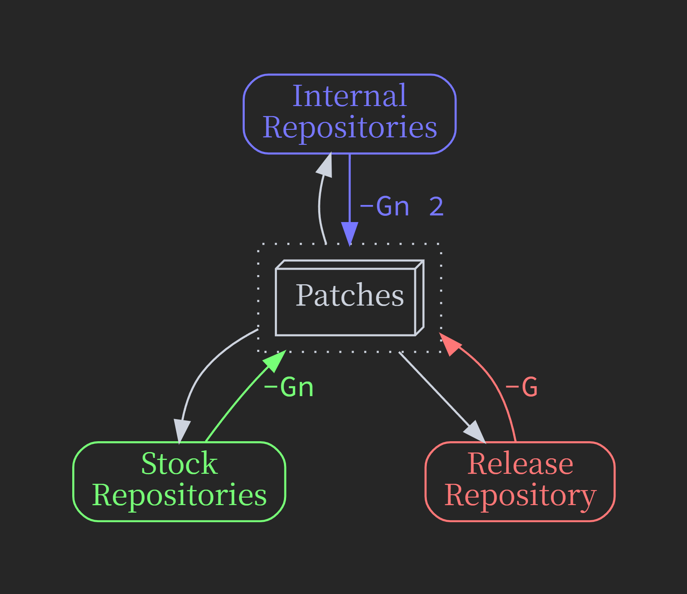

..
   SPDX-FileCopyrightText: 2024 Yun Hsiao Wu <yunhsiaow@gmail.com>
   SPDX-License-Identifier: MIT

.. _Iteration:

Multilateral Iteration
======================

Repositories can be categorized into three types:

- The latest release engine repo (``Release``)
- Any stock version engine repo (``Stock``)
- Any in-house engine repo (``Internal``)

Three strategies are provided for updating patches accordingly:

``-G``: Full-scale update for all patches relevant to the current engine version.

``-Gn``: Only update patches that actually changed,
or within the engine version range explicitly specified in :ref:`Decorators`.

``-Gn 2``: Only update patches that actually changed.

Since we are maintaining the same set of patches across repos, update strategies must be chosen carefully
to migrate changes smoothly.

Workspace Setup
---------------

First, you should **link** all the relevant plugin folders into every engine repositories you want to port to,
this way only one set of plugin repositories is maintained, which greatly simplified the workflow.
The setup script is written carefully with this kind of environment in mind,
you can just run the same script from different linked directory and it will update the parent repository accordingly.

A multi-root workspace can be setup as follows:

.. code-block:: json

   {
      "folders": [
         {
            "name": "Release",
            "path": "C:/UnrealEngine-release/Engine/Source"
         },
         {
            "name": "Stock",
            "path": "C:/UnrealEngine-4-27/Engine/Source"
         },
         {
            "name": "Internal",
            "path": "C:/UnrealEngine-internal/Engine/Source"
         },
         {
            "path": "C:/UnrealEngine-release/Engine/Plugins/Crysknife"
         },
         {
            "path": "C:/UnrealEngine-release/Engine/Plugins/YourPlugin"
         }
      ],
      "settings": {
         "dotnet.defaultSolution": "${workspaceFolder:Crysknife}/Crysknife.sln"
      },
      "tasks": {
         "version": "2.0.0",
         "tasks": [
            {
               "type": "shell",
               "command": "dotnet build ${workspaceFolder:Crysknife}/Crysknife",
               "label": "build crysknife"
            }
         ]
      },
      "launch": {
         "version": "0.2.0",
         "configurations": [
            {
               "name": "Debug Crysknife",
               "type": "coreclr",
               "request": "launch",
               "preLaunchTask": "build crysknife",
               "program": "${workspaceFolder:Crysknife}/Crysknife/bin/Debug/net6.0/Crysknife.dll",
               "cwd": "${workspaceFolder:Crysknife}",
               "stopAtEntry": false,
               "console": "internalConsole",
               "args": [
                  "-P", "YourPlugin", "-E",

                  "${workspaceFolder:Release}/../..",
                  "-G",

                  // "${workspaceFolder:Stock}/../..",
                  // "-Gn",

                  // "${workspaceFolder:Internal}/../..",
                  // "-Gn", "2",

                  // "-df",
               ],
            },
         ],
      },
   }

Iteration Examples
------------------

Say we just finished development under ``Release``, now want to port to ``Stock``:

.. code-block:: bash

   # Generate patches from release, apply to stock

   ${workspaceFolder:Release}/../Plugins/YourPlugin/Setup.sh -G
   ${workspaceFolder:Stock}/../Plugins/YourPlugin/Setup.sh

Then switch to ``Stock`` and start resolving conflicts & do the actual porting. After finished:

.. code-block:: bash

   # Generate patches from stock, apply to release

   # Using incremental generation that preserves the history patch
   # if it deemed equal and not specific to current engine version
   ${workspaceFolder:Stock}/../Plugins/YourPlugin/Setup.sh -Gn
   ${workspaceFolder:Release}/../Plugins/YourPlugin/Setup.sh

This way the patches are updated incrementally, making it much easier and focused to sync back to the ``Release`` repo.
It may take some back-and-forth efforts, but do make sure the same set of patches are up-to-date for both engines,
which is critical for a smooth deployment experience.

Finally, when the porting is done, the same process still applies **anywhere anytime** changes are made.
Say we just fixed a rare corner case found in ``Internal`` repo, to properly commit the changes, follow these steps:

.. code-block:: bash

   # Generate patches from internal, sync with all others

   # Incremental generation that preserves the history patch if it deemed equal
   ${workspaceFolder:Internal}/../Plugins/YourPlugin/Setup.sh -Gn 2

   # Apply to release & sync patches
   ${workspaceFolder:Release}/../Plugins/YourPlugin/Setup.sh -AG

   # Apply to stock & sync patches
   ${workspaceFolder:Stock}/../Plugins/YourPlugin/Setup.sh -AGn

   # Sync back to internal, to make sure everything is up-to-date
   ${workspaceFolder:Internal}/../Plugins/YourPlugin/Setup.sh

   # Now you are ready submit new changes for all relevant plugins
